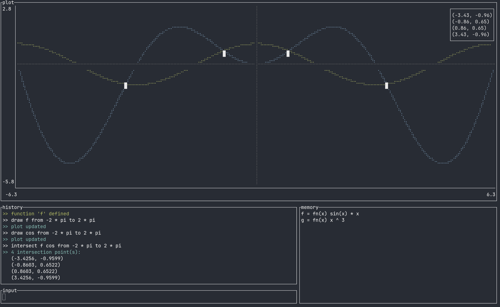

# rulc
### Easy to use TUI REPL calculator with plot support



## Installation
cargo: `cargo install rulc`

## Usage
- `rulc` for REPL mode
- `rulc --tui` for TUI mode
- `rulc --exec <expression>` for inline mode

In TUI mode, both `Esc` and `Ctrl+C` quit the app.

## Operators

| Operator       | Syntax  | Example          |
| -------------- | ------- | ---------------- |
| Addition       | `a + b` | `2 + 3` → `5`   |
| Subtraction    | `a - b` | `10 - 4` → `6`  |
| Multiplication | `a * b` | `3 * 4` → `12`  |
| Division       | `a / b` | `9 / 2` → `4.5` |
| Exponentiation | `a ^ b` | `2 ^ 8` → `256` |
| Unary minus    | `-a`    | `-5` → `-5`     |

## Built-in functions

| Function       | Syntax   | Description           |
| -------------- | -------- | --------------------- |
| Sine           | `sin(x)` | Sine of x (radians)   |
| Cosine         | `cos(x)` | Cosine of x (radians) |
| Tangent        | `tan(x)` | Tangent of x (radians)|
| Arcsine        | `asin(x)`| Inverse sine          |
| Arccosine      | `acos(x)`| Inverse cosine        |
| Arctangent     | `atan(x)`| Inverse tangent       |
| Square root    | `sqrt(x)`| Square root of x      |
| Natural log    | `ln(x)`  | Logarithm base e      |
| Log base 10    | `log(x)` | Logarithm base 10     |
| Absolute value | `abs(x)` | \|x\|                 |
| Ceiling        | `ceil(x)`| Round up to integer   |
| Floor          | `floor(x)`| Round down to integer|

## Built-in constants

| Constant       | Syntax | Value     |
| -------------- | ------ | --------- |
| Pi             | `pi`   | 3.14159…  |
| Euler's number | `e`    | 2.71828…  |

## Variables and functions

Assign a variable:
```
x = 5
y = x * 2 + 1
```

Compound assignment:
```
x += 10
x *= 2
```

Define a custom function:
```
f(x) = x^2 + 2*x + 1
g(x) = sin(x) / x
```

## Plotting graphs

Plots are available in TUI mode (`rulc --tui`).

**Syntax:**
```
draw <function> from <expr> to <expr>
```

**Examples:**

Plot a built-in function:
```
draw sin from -pi to pi
```

Define and plot a custom function:
```
f(x) = x^2 - 4
draw f from -5 to 5
```

Plot using a computed range:
```
draw cos from -2*pi to 2*pi
```

After entering a `draw` command the chart panel updates automatically. The x and y axes scale to fit the plotted range, and the zero axes are shown in gray when they fall within the visible area.

Multiple `draw` commands layer their curves on the same chart, each in its own color (up to 5 plots at once; further `draw` commands are rejected until you `clear plots`). Points where a function is undefined (e.g. division by zero) are skipped instead of aborting the plot, and statistical outliers near an asymptote are filtered out so a single blown-up sample doesn't stretch the whole chart.

## Finding intersections

**Syntax:**
```
intersect <function> <function> from <expr> to <expr>
```

**Example:**
```
f(x) = x^2
g(x) = x + 2
intersect f g from -5 to 5
```

Both functions are sampled over the given range and checked for sign changes in their difference; the crossing is then linearly interpolated between samples for a more precise `(x, y)`. In REPL mode the found points are printed one per line. In TUI mode they're additionally marked on the chart and labeled `(x, y)` in the plot's legend.

## Clearing

| Command         | Effect                                              |
| ---------------- | --------------------------------------------------- |
| `clear plots`    | Removes all plotted curves and intersection markers |
| `clear history`  | Clears the REPL/TUI output history                  |
| `clear memory`   | Removes all user-defined variables and functions (builtins are untouched) |
| `clear <name>`   | Removes a single user-defined variable or function by name |
| `clear`          | Clears both plots and history                       |

Clearing an unknown name reports `unknown variable for clear: '<name>', usage: clear <history|memory|plots|<name>>`. Builtins (`sin`, `pi`, etc.) can't be cleared.

## Project structure 
```
├── core
└── ├── evaluator           // evaluates parsed expressions
└── ├── lexer               // tokenizes input
└── ├── operations          // defines arithmetic operations
└── ├── parser              // parses tokenized input
└── ├── ├── numeric         // parses numeric expressions
└── ├── registries          // registries for identifiers and operation 
└── view                    // program modes (inline, REPL, TUI) 
└── main.rs                 // program entry point
```

## Evaluation algorithm
1. Tokenize the input using the lexer
2. Parse the tokenized input using the parser
3. Evaluate the parsed expression using the evaluator (Pratt expression parser)

## License
Licensed under the GNU General Public License v3.0 or later (GPL-3.0-or-later). See [LICENSE](LICENSE) for the full text.
