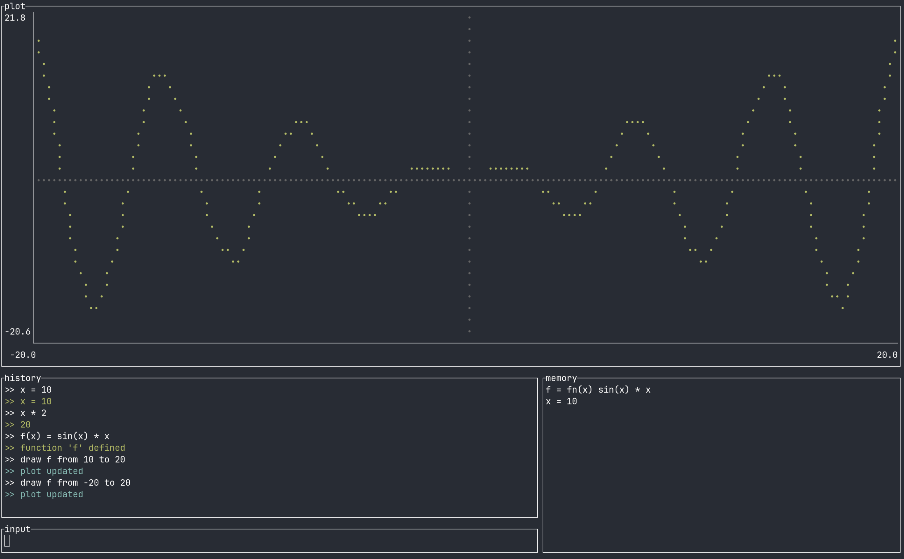

# rulc
`rulc` is easy to use TUI REPL calculator with plot support


## Usage
- `git clone <this repo>`
- `cargo run | cargo run -- --exec <math expression here> | cargo run -- --tui`

## Project structure 
```
├── core
└── ├── evaluator           // evaluates parsed expressions
└── ├── lexer               // tokenizes input
└── ├── operations          // defines arithmetic operations
└── ├── parser              // parses tokenized input
└── ├── ├── numeric         // parses numeric expressions
└── ├── registries          // registries for identifiers and operation 
└── view                    // program modes (inline, REPL, TUI) 
└── main.rs                 // program entry point
```

## Evaluation algorithm
1. Tokenize the input using the lexer
2. Parse the tokenized input using the parser
3. Evaluate the parsed expression using the evaluator (Pratt expression parser)
